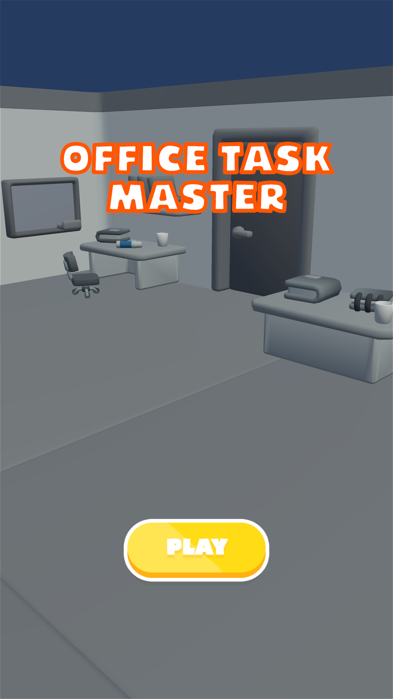
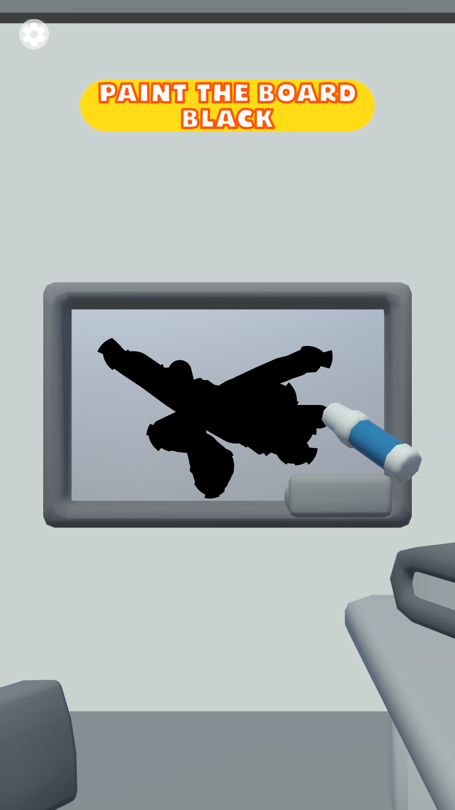
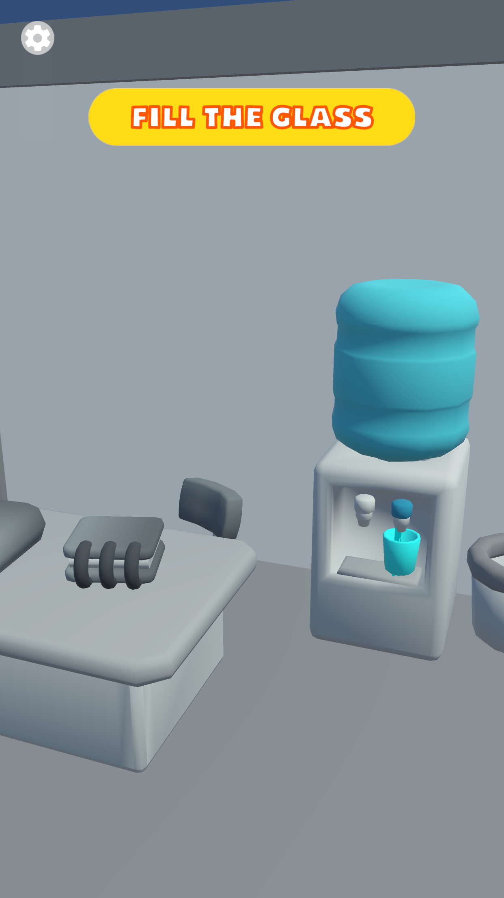
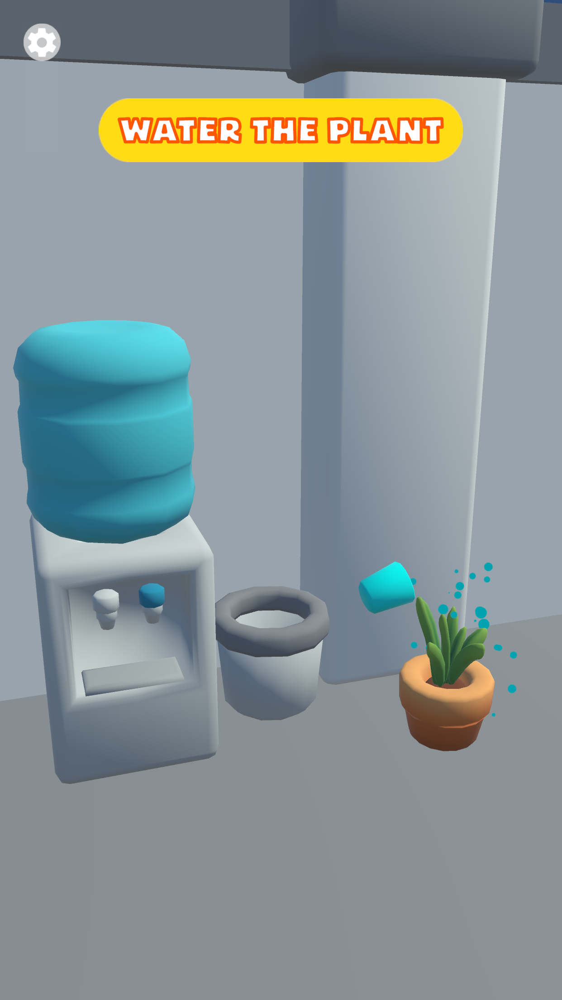
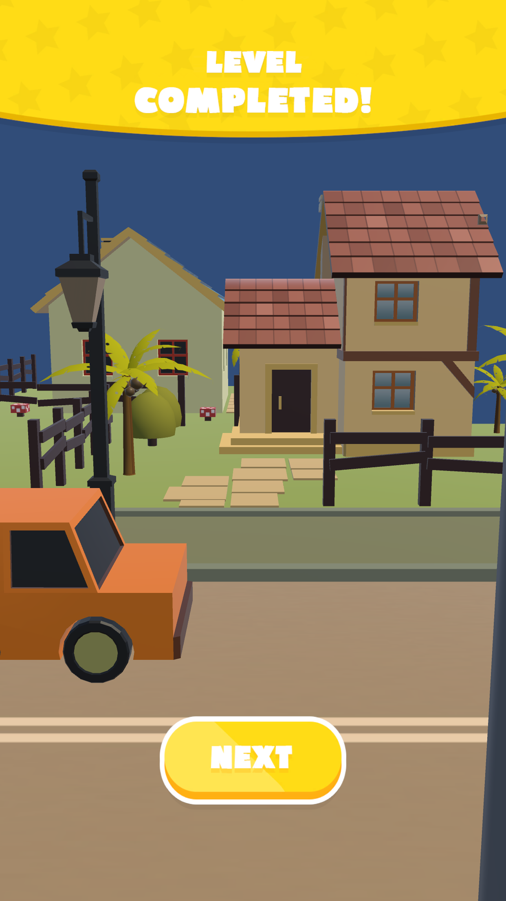

# Office Task Master

Office Task Master, Hyper Casual Game.


## Getting Started

Follow the below instructions to get started with Office Task Master source code:

1. [Download Source Code](#download)
2. Open Project in Unity and Enjoy!

## Requirements

Make sure you have the below requirements before starting:

- [Unity Game Engine](https://unity3d.com) Version: 2021.3.30f1
- Basic Knowledge about Unity and C#

## Download

You can get access to Red Runner source code by using one of the following ways:

- [:sparkles: Download Source Code](https://github.com/furkanacikkol/OfficeTaskMaster.git)
- Clone the repository locally:

```bash
git clone https://github.com/furkanacikkol/OfficeTaskMaster.git
```

## Screenshots

<p align="center">
  
</p>

<p align="center">
  
</p>

<p align="center">
  
</p>

<p align="center">
  
</p>

<p align="center">
  
</p>
